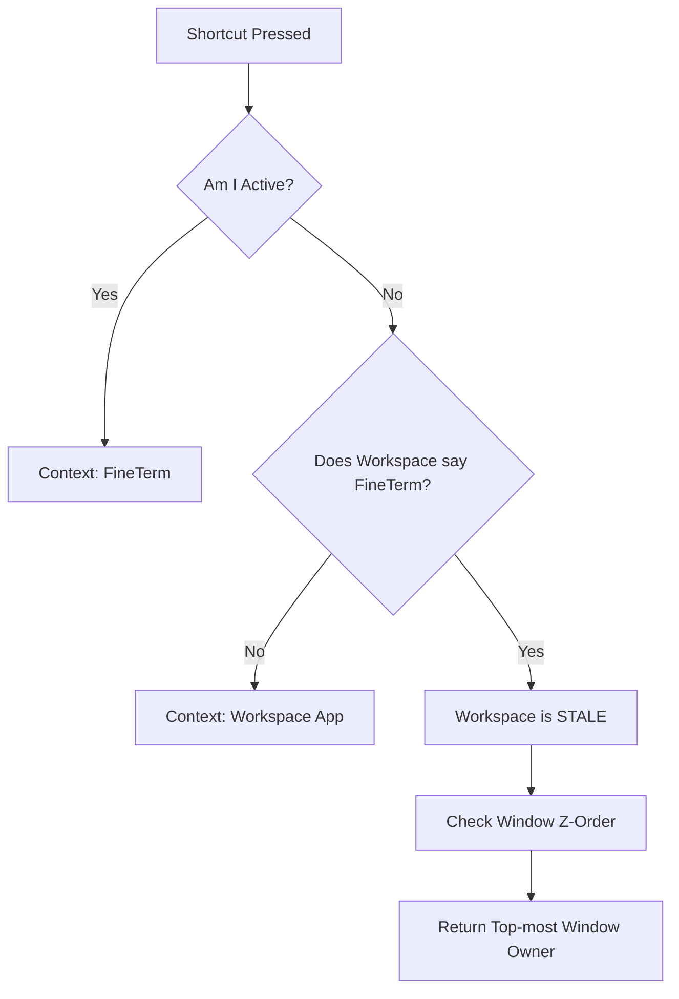

# [003] Keyboard Interceptor & State Machine

## 1. Summary
The `KeyboardInterceptor` is a low-level CoreGraphics Event Tap that listens for global shortcuts. It manages the "Activation Loop" state machine.

## 2. The Loop State Machine

The goal is to cycle focus: **Origin -> FineTerm -> Terminal -> Origin**.

| Step | Current Context | Condition | Action | State Change |
| :--- | :--- | :--- | :--- | :--- |
| **1** | **Origin** (e.g. Chrome) | `!FineTerm` && `!Terminal` | Activate FineTerm | `savedOriginBundleID = "com.google.Chrome"` |
| **2** | **FineTerm** | `isFineTermFront` | Activate Terminal | None |
| **3** | **Terminal** | `isTerminalFront` | Activate `savedOriginBundleID` | None |

## 3. Detection Logic (`getRealFrontmostApp`)
Determining "Current Context" is harder than it looks due to macOS animation lag.

## 4. Key Classes
*   **`KeyboardInterceptor.swift`**: Contains the `CGEventTap` callback and the `getRealFrontmostApp` logic.
*   **`savedOriginBundleID`**: A private static variable that holds the "Memory" of where the user came from.

## 5. Edge Cases
*   **Overwriting Origin:** If the detection logic is flaky, Step 3 (Terminal) might think it's actually Step 1 (Origin), and save "Terminal" as the origin. We explicitly prevent saving `com.apple.Terminal` or `com.local.FineTerm` to `savedOriginBundleID`.
*   **Global Anywhere:** If the `Global Shortcut Anywhere` setting is OFF, the interceptor ignores keystrokes unless the front app is Terminal or FineTerm.
